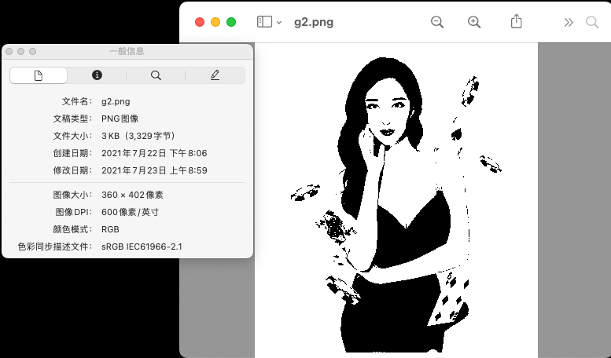
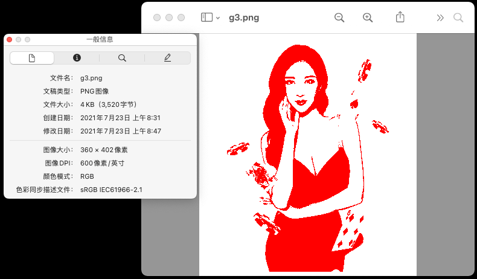

#  how to generate 2-colors, PNG8, 600px png

```sh
$ identify -verbose pngs/g*.png | egrep "Colors:|Depth:|Version|Filename:"
  Filename: pngs/g.png
  Depth: 8-bit
  Colors: 58
  Filename: pngs/g2.png
  Depth: 8/1-bit
  Colors: 2
  Filename: pngs/g3.png
  Depth: 8/1-bit
  Colors: 2
  Filename: pngs/g4.png
  Depth: 8-bit
  Colors: 2
  Version: ImageMagick 7.1.0-4 Q16 x86_64 2021-07-18 https://imagemagick.org
```





