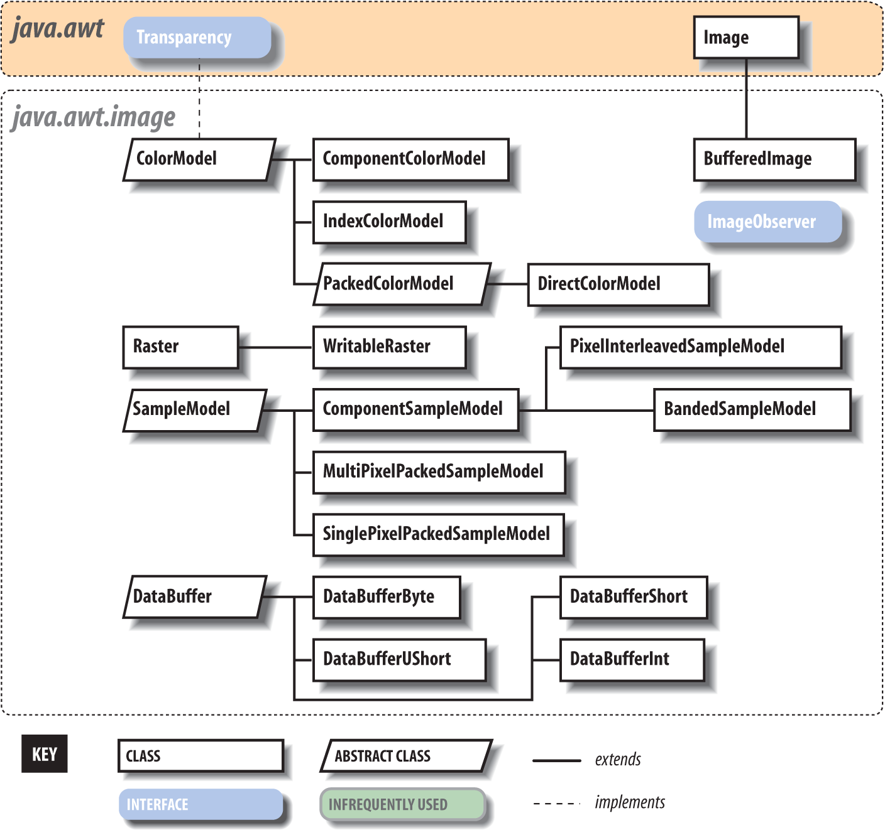
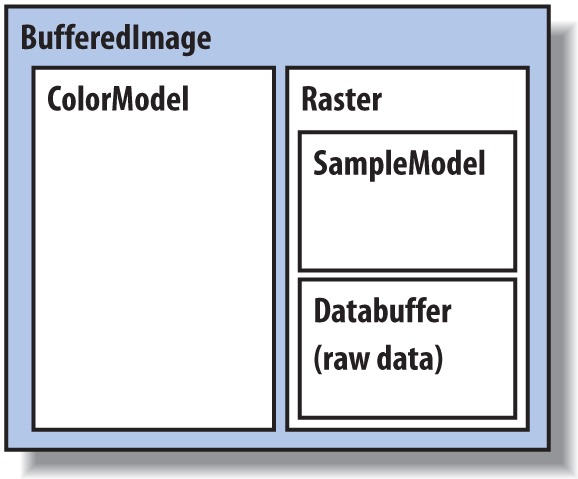
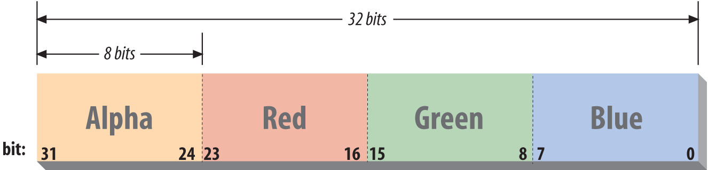
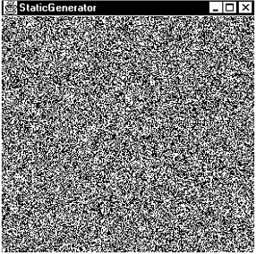

# Chapter 21. Working with Images and Other Media

https://blog.naver.com/PostView.naver?blogId=banks&logNo=220243767493

Until this point, we’ve confined ourselves to working with the high-level drawing commands of the Graphics2D class, using images in a hands-off mode. In this section, we’ll clear up some of the mystery surrounding images and see how they can be created and transformed. The classes in the java.awt.image package handle images and their internals; Figure 21-1 shows the important classes in this package.

First, we’ll return to our discussion of image loading and see how we can get more control over image data using an ImageObserverto watch as it’s processed asynchronously by GUI components. We’ll also see how to use the MediaTracker utility to handle the details for us. Then, we’ll move on to the good stuff and have a look at BufferedImage, which is an image whose pixel data is exposed to you through a memory buffer. If you’re interested in creating sophisticated graphics, rendered images, or video, this will teach you about the foundations of image construction in Java.

Looking in the other directions, we will also be referring occasionally to the javax.imageio package, which is part of the Java Advanced Imaging API (JAI). If you need even more advanced capabilities such as image tiling, loading scaled versions of images over the network, and deferred execution of image data processing for working with really large images, you’ll want to look at JAI.



Figure 21-1. The java.awt.image package

## Loading Images

One of the challenges in building software for networked applications is that data is not always instantly available. Since some of Java’s roots are in Internet applications such as web browsers, its image handling APIs were designed specifically to accommodate the fact that images might take some time to load over a slow network, providing for detailed information about image-loading progress. While many client applications do not require handling of image data in this way, it’s still useful to understand this mechanism if for no other reason than it appears in the most basic image-related APIs. The Swing toolkit adds its own layer of image handling over this with components such as ImageIcon, which encapsulates an image source for you. After reading this chapter, you’ll have an understanding of how the layers fit together.

### ImageObserver
In the previous chapter, we mentioned that all operations on image data (e.g., loading, drawing, scaling) allow you to specify an “image observer” object as a participant. An image observer implements the ImageObserver interface, allowing it to receive notification as information about the image becomes available. The image observer is essentially a callback that is notified progressively as the image is loaded. For a static image, such as a GIF or JPEG data file, the observer is notified as chunks of image data arrive and also when the entire image is complete. For a video source or animation (e.g., GIF89), the image observer is notified at the end of each frame as the continuous stream of pixel data is generated.

The image observer can do whatever it wants with this information. For example, in the last chapter we used the image observer built into the base Component class. Although you probably didn’t see it happen in our examples, the Component image observer invoked repaint() for us each time a new section of the image became available so that the picture, if it had taken a long time to load, would have displayed progressively. A different kind of image observer might have waited for the entire image before telling the application to display it; yet another use for an observer might be to update a loading meter showing how far the image loading had progressed.

To be an image observer, implement the imageUpdate() method, which is defined by the java.awt.image.ImageObserver interface:

```java
public boolean imageUpdate(Image image, int flags, int x, int y,int width, int height)
```

imageUpdate() is called by the graphics system, as needed, to pass the observer information about the construction of its view of the image. The image parameter holds a reference to the Image object in question. flags is an integer whose bits specify what information about the image is now available. The flag values are defined as static variables in the ImageObserver interface, as illustrated in this example:

```java
//file: ObserveImageLoad.java
    import java.awt.*;
    import java.awt.image.*;

    public class ObserveImageLoad {

      public static void main( String [] args)
      {
       ImageObserver myObserver = new ImageObserver() {
          public boolean imageUpdate(
             Image image, int flags, int x, int y, int width, int height)
          {
             if ( (flags & HEIGHT) !=0 )
               System.out.println("Image height = " + height );
             if ( (flags & WIDTH ) !=0 )
               System.out.println("Image width = " + width );
             if ( (flags & FRAMEBITS) != 0 )
               System.out.println("Another frame finished.");
             if ( (flags & SOMEBITS) != 0 )
                System.out.println("Image section :"
                    + new Rectangle( x, y, width, height ) );
             if ( (flags & ALLBITS) != 0 )
               System.out.println("Image finished!");
             if ( (flags & ABORT) != 0 )
               System.out.println("Image load aborted...");
             return true;
         }
       };

        Toolkit toolkit = Toolkit.getDefaultToolkit();
        Image img = toolkit.getImage( args[0] );
        toolkit.prepareImage( img, -1, -1, myObserver );
      }
    }
```

Run the example, supplying an image file as the command-line argument and observe the output. You’ll see a number of incremental messages about loading the image.

The flags integer determines which of the other parameters—x, y, width, and height—hold valid data and what that data means. To test whether a particular flag in the flags integer is set, we have to resort to some binary shenanigans—using the & (AND) operator). The width and height parameters play a dual role. If SOMEBITS is set, they represent the size of the chunk of the image that has just been delivered. If HEIGHT or WIDTH is set, however, they represent the overall image dimensions. Finally, imageUpdate() returns aboolean value indicating whether or not it’s interested in future updates.

In this example, after requesting the Image object with getImage(), we kick-start the loading process with the Toolkit’sprepareImage() method, which takes our image observer as an argument. Using an Image API method such as drawImage(),scaleImage(), or asking for image dimensions with getWidth() or getHeight() will also suffice to start the operation. Remember that although the getImage() method created the image object, it doesn’t begin loading the data until one of the image operations requires it.

The example shows the lowest-level general mechanism for starting and monitoring the process of loading image data. You should be able to see how we could implement all sorts of sophisticated image loading and tracking schemes with this. The two most important strategies (to draw an image progressively, as it’s constructed, or to wait until it’s complete and draw it in its entirety) are handled for us. We have already seen that the Component class implements the first scheme. Another class, java.awt.MediaTracker, is a general utility that tracks the loading of a number of images or other media types for us. We’ll look at it in the next section.

### MediaTracker

java.awt.MediaTracker is a utility class that simplifies life if we have to wait for one or more images to be loaded completely before they’re displayed. A MediaTracker monitors the loading of an image or a group of images and lets us check on them periodically or wait until they are finished. MediaTracker implements the ImageObserver interface that we just discussed, allowing it to receive image updates.

The following code snippet illustrates how to use a MediaTracker to wait while an image is prepared:

```java
 //file: StatusImage.java
    import java.awt.*;
    import javax.swing.*;

    public class StatusImage extends JComponent
    {
      boolean loaded = false;
      String message = "Loading...";
      Image image;

      public StatusImage( Image image ) { this.image = image; }

      public void paint(Graphics g) {
        if (loaded)
            g.drawImage(image, 0, 0, this);
        else {
          g.drawRect(0, 0, getSize().width - 1, getSize().height - 1);
          g.drawString(message, 20, 20);
        }
      }
      public void loaded() {
        loaded = true;
        repaint();
      }
      public void setMessage( String msg ) {
        message = msg;
        repaint();
      }

      public static void main( String [] args ) {
        JFrame frame = new JFrame("TrackImage");
        Image image = Toolkit.getDefaultToolkit().getImage( args[0] );
        StatusImage statusImage = new StatusImage( image );
        frame.add( statusImage );
        frame.setSize(300,300);
        frame.setVisible(true);

        MediaTracker tracker = new MediaTracker( statusImage );
        int MAIN_IMAGE = 0;
        tracker.addImage( image, MAIN_IMAGE );
        try {
            tracker.waitForID( MAIN_IMAGE ); }
        catch (InterruptedException e) {}
        if ( tracker.isErrorID( MAIN_IMAGE ) )
            statusImage.setMessage( "Error" );
        else
            statusImage.loaded();
      }
    }
```

In this example, we created a trivial component called StatusImage that accepts an image and draws a text status message until it is told that the image is loaded. It then displays the image. The only interesting part here is that we use a MediaTracker to load the image data for us, simplifying our logic.

First, we create a MediaTracker to manage the image. The MediaTracker constructor takes a Component as an argument; this is supposed to be the component onto which the image is later drawn. This argument is somewhat of a holdover from earlier Java days with AWT. If you don’t have the component reference handy, you can simply substitute a generic component reference like so:

```java
Component comp = new Component();
```

After creating the MediaTracker, we assign it images to manage. Each image is associated with an integer that identifier we can use later for checking on its status or to wait for its completion. Multiple images can be associated with the same identifier, letting us manage them as a group. The value of the identifier is also meant to prioritize loading when waiting on multiple sets of images; lower IDs have higher priority. In this case, we want to manage only a single image, so we created one identifier called MAIN_IMAGEand passed it as the ID for our image in the call to addImage().

Next, we call the MediaTracker waitforID() routine, which blocks on the image, waiting for it to finish loading. If successful, we tell our example component to use the image and repaint. Another MediaTracker method, waitForAll(), waits for all images to complete, not just a single ID. It’s possible to be interrupted here by an InterruptedException. We should also test for errors during image preparation with isErrorID(). In our example, we change the status message if we find one.

The MediaTracker checkID() and checkAll() methods may be used to poll periodically the status of images loading, returning trueor false to indicate whether loading is finished. The checkAll() method does this for the union of all images being loaded. Additionally, the statusID() and statusAll() methods return a constant indicating the status or final condition of an image load. The value is one of the MediaTracker constant values: LOADING, ABORTED, ERROR, or COMPLETE. For statusAll(), the value is the bitwise OR value of all of the various statuses.

This may seem like a lot of work to go through just to put up a status message while loading a single image. MediaTracker is more valuable when you are working with many raw images that have to be available before you can begin parts of an application. It saves implementing a custom ImageObserver for every application. For general Swing application work, you can use yet another simplification by employing the ImageIcon component to use a MediaTracker. This is covered next.

### ImageIcon

In [Chapter 17](http://chimera.labs.oreilly.com/books/1234000001805/ch17.html), we discussed Swing components that can work with images using the Icon interface. In particular, the ImageIconclass accepts an image filename or URL and can render it into a component. Internally, ImageIcon uses a MediaTracker to fully load the image in the call to its constructor. It can also provide the Image reference back. So, a shortcut to what we did in the last few sections—getting an image loaded fully before using it—would be:

```java
    ImageIcon icon = new ImageIcon("myimage.jpg");
    Image image = icon.getImage();
```

This quirky approach saves a few lines of typing, but uses an icon in an odd way and is not very clear. ImageIcon also gives you direct access to the MediaTracker it’s using through the getMediaTracker() method or tells you the MediaTracker load status through thegetImageLoadStatus() method. This returns one of the MediaTracker constants: ABORTED, ERROR, or COMPLETE.

### ImageIO

As we mentioned in the introduction to Chapter 1, the javax.imageio package is a standard extension that deals with reading and writing many image formats. It is a part of the larger Java Advanced Imaging (JAI) API. This API supports advanced manipulation and display of images. While the AWT has a relatively fixed set of functionality, JAI is an extensible framework that accepts plug-ins for new image formats and features. The imageio portion of JAI is bundled with Java 1.4 and later, so we can take advantage of it on all current Java releases. ImageIO effectively supercedes the APIs we’ve talked about here with new ones for loading and monitoring image data, and although we won’t cover it in detail, we will discuss it briefly here for several reasons. First, it is fairly easy to use. Second, ImageIO natively works with BufferedImages and not just plain AWT Images. As we’ll discuss throughout the rest of this chapter, buffered images can expose their pixel data for you to read or manipulate. Finally, using ImageIO allows you both to load and save BufferedImages to files. The core AWT has no tools for encoding image data for saving to files.

Previously, we showed how easy it is to load an image with the static read() methods of the ImageIO class, which accept either aFile, URL, or InputStream:

```java
    File file = new File("/Users/pat/images/boojum.gif");
    BufferedImage bi = ImageIO.read( file );
```


Chapter 21. Working with Images and Other Media  LearningJava,4Th
2015. 1. 18. 2:54
             복사https://blog.naver.com/banks/220243767493
             번역하기
             http://chimera.labs.oreilly.com/books/1234000001805/ch21.html


Learning Java
chimera.labs.oreilly.com

Chapter 21. Working with Images and Other Media


Until this point, we’ve confined ourselves to working with the high-level drawing commands of the Graphics2D class, using images in a hands-off mode. In this section, we’ll clear up some of the mystery surrounding images and see how they can be created and transformed. The classes in the java.awt.image package handle images and their internals; Figure 21-1 shows the important classes in this package.

First, we’ll return to our discussion of image loading and see how we can get more control over image data using an ImageObserverto watch as it’s processed asynchronously by GUI components. We’ll also see how to use the MediaTracker utility to handle the details for us. Then, we’ll move on to the good stuff and have a look at BufferedImage, which is an image whose pixel data is exposed to you through a memory buffer. If you’re interested in creating sophisticated graphics, rendered images, or video, this will teach you about the foundations of image construction in Java.

Looking in the other directions, we will also be referring occasionally to the javax.imageio package, which is part of the Java Advanced Imaging API (JAI). If you need even more advanced capabilities such as image tiling, loading scaled versions of images over the network, and deferred execution of image data processing for working with really large images, you’ll want to look at JAI.


Figure 21-1. The java.awt.image package
Loading Images
One of the challenges in building software for networked applications is that data is not always instantly available. Since some of Java’s roots are in Internet applications such as web browsers, its image handling APIs were designed specifically to accommodate the fact that images might take some time to load over a slow network, providing for detailed information about image-loading progress. While many client applications do not require handling of image data in this way, it’s still useful to understand this mechanism if for no other reason than it appears in the most basic image-related APIs. The Swing toolkit adds its own layer of image handling over this with components such as ImageIcon, which encapsulates an image source for you. After reading this chapter, you’ll have an understanding of how the layers fit together.

ImageObserver
In the previous chapter, we mentioned that all operations on image data (e.g., loading, drawing, scaling) allow you to specify an “image observer” object as a participant. An image observer implements the ImageObserver interface, allowing it to receive notification as information about the image becomes available. The image observer is essentially a callback that is notified progressively as the image is loaded. For a static image, such as a GIF or JPEG data file, the observer is notified as chunks of image data arrive and also when the entire image is complete. For a video source or animation (e.g., GIF89), the image observer is notified at the end of each frame as the continuous stream of pixel data is generated.

The image observer can do whatever it wants with this information. For example, in the last chapter we used the image observer built into the base Component class. Although you probably didn’t see it happen in our examples, the Component image observer invoked repaint() for us each time a new section of the image became available so that the picture, if it had taken a long time to load, would have displayed progressively. A different kind of image observer might have waited for the entire image before telling the application to display it; yet another use for an observer might be to update a loading meter showing how far the image loading had progressed.

To be an image observer, implement the imageUpdate() method, which is defined by the java.awt.image.ImageObserver interface:

    public boolean imageUpdate(Image image, int flags, int x, int y,
                               int width, int height)
imageUpdate() is called by the graphics system, as needed, to pass the observer information about the construction of its view of the image. The image parameter holds a reference to the Image object in question. flags is an integer whose bits specify what information about the image is now available. The flag values are defined as static variables in the ImageObserver interface, as illustrated in this example:

    //file: ObserveImageLoad.java
    import java.awt.*;
    import java.awt.image.*;

    public class ObserveImageLoad {

      public static void main( String [] args)
      {
       ImageObserver myObserver = new ImageObserver() {
          public boolean imageUpdate(
             Image image, int flags, int x, int y, int width, int height)
          {
             if ( (flags & HEIGHT) !=0 )
               System.out.println("Image height = " + height );
             if ( (flags & WIDTH ) !=0 )
               System.out.println("Image width = " + width );
             if ( (flags & FRAMEBITS) != 0 )
               System.out.println("Another frame finished.");
             if ( (flags & SOMEBITS) != 0 )
                System.out.println("Image section :"
                    + new Rectangle( x, y, width, height ) );
             if ( (flags & ALLBITS) != 0 )
               System.out.println("Image finished!");
             if ( (flags & ABORT) != 0 )
               System.out.println("Image load aborted...");
             return true;
         }
       };

        Toolkit toolkit = Toolkit.getDefaultToolkit();
        Image img = toolkit.getImage( args[0] );
        toolkit.prepareImage( img, -1, -1, myObserver );
      }
    }
Run the example, supplying an image file as the command-line argument and observe the output. You’ll see a number of incremental messages about loading the image.

The flags integer determines which of the other parameters—x, y, width, and height—hold valid data and what that data means. To test whether a particular flag in the flags integer is set, we have to resort to some binary shenanigans—using the & (AND) operator). The width and height parameters play a dual role. If SOMEBITS is set, they represent the size of the chunk of the image that has just been delivered. If HEIGHT or WIDTH is set, however, they represent the overall image dimensions. Finally, imageUpdate() returns aboolean value indicating whether or not it’s interested in future updates.

In this example, after requesting the Image object with getImage(), we kick-start the loading process with the Toolkit’sprepareImage() method, which takes our image observer as an argument. Using an Image API method such as drawImage(),scaleImage(), or asking for image dimensions with getWidth() or getHeight() will also suffice to start the operation. Remember that although the getImage() method created the image object, it doesn’t begin loading the data until one of the image operations requires it.

The example shows the lowest-level general mechanism for starting and monitoring the process of loading image data. You should be able to see how we could implement all sorts of sophisticated image loading and tracking schemes with this. The two most important strategies (to draw an image progressively, as it’s constructed, or to wait until it’s complete and draw it in its entirety) are handled for us. We have already seen that the Component class implements the first scheme. Another class, java.awt.MediaTracker, is a general utility that tracks the loading of a number of images or other media types for us. We’ll look at it in the next section.

MediaTracker
java.awt.MediaTracker is a utility class that simplifies life if we have to wait for one or more images to be loaded completely before they’re displayed. A MediaTracker monitors the loading of an image or a group of images and lets us check on them periodically or wait until they are finished. MediaTracker implements the ImageObserver interface that we just discussed, allowing it to receive image updates.

The following code snippet illustrates how to use a MediaTracker to wait while an image is prepared:

    //file: StatusImage.java
    import java.awt.*;
    import javax.swing.*;

    public class StatusImage extends JComponent
    {
      boolean loaded = false;
      String message = "Loading...";
      Image image;

      public StatusImage( Image image ) { this.image = image; }

      public void paint(Graphics g) {
        if (loaded)
            g.drawImage(image, 0, 0, this);
        else {
          g.drawRect(0, 0, getSize().width - 1, getSize().height - 1);
          g.drawString(message, 20, 20);
        }
      }
      public void loaded() {
        loaded = true;
        repaint();
      }
      public void setMessage( String msg ) {
        message = msg;
        repaint();
      }

      public static void main( String [] args ) {
        JFrame frame = new JFrame("TrackImage");
        Image image = Toolkit.getDefaultToolkit().getImage( args[0] );
        StatusImage statusImage = new StatusImage( image );
        frame.add( statusImage );
        frame.setSize(300,300);
        frame.setVisible(true);

        MediaTracker tracker = new MediaTracker( statusImage );
        int MAIN_IMAGE = 0;
        tracker.addImage( image, MAIN_IMAGE );
        try {
            tracker.waitForID( MAIN_IMAGE ); }
        catch (InterruptedException e) {}
        if ( tracker.isErrorID( MAIN_IMAGE ) )
            statusImage.setMessage( "Error" );
        else
            statusImage.loaded();
      }
    }
In this example, we created a trivial component called StatusImage that accepts an image and draws a text status message until it is told that the image is loaded. It then displays the image. The only interesting part here is that we use a MediaTracker to load the image data for us, simplifying our logic.

First, we create a MediaTracker to manage the image. The MediaTracker constructor takes a Component as an argument; this is supposed to be the component onto which the image is later drawn. This argument is somewhat of a holdover from earlier Java days with AWT. If you don’t have the component reference handy, you can simply substitute a generic component reference like so:

    Component comp = new Component();
After creating the MediaTracker, we assign it images to manage. Each image is associated with an integer that identifier we can use later for checking on its status or to wait for its completion. Multiple images can be associated with the same identifier, letting us manage them as a group. The value of the identifier is also meant to prioritize loading when waiting on multiple sets of images; lower IDs have higher priority. In this case, we want to manage only a single image, so we created one identifier called MAIN_IMAGEand passed it as the ID for our image in the call to addImage().

Next, we call the MediaTracker waitforID() routine, which blocks on the image, waiting for it to finish loading. If successful, we tell our example component to use the image and repaint. Another MediaTracker method, waitForAll(), waits for all images to complete, not just a single ID. It’s possible to be interrupted here by an InterruptedException. We should also test for errors during image preparation with isErrorID(). In our example, we change the status message if we find one.

The MediaTracker checkID() and checkAll() methods may be used to poll periodically the status of images loading, returning trueor false to indicate whether loading is finished. The checkAll() method does this for the union of all images being loaded. Additionally, the statusID() and statusAll() methods return a constant indicating the status or final condition of an image load. The value is one of the MediaTracker constant values: LOADING, ABORTED, ERROR, or COMPLETE. For statusAll(), the value is the bitwise OR value of all of the various statuses.

This may seem like a lot of work to go through just to put up a status message while loading a single image. MediaTracker is more valuable when you are working with many raw images that have to be available before you can begin parts of an application. It saves implementing a custom ImageObserver for every application. For general Swing application work, you can use yet another simplification by employing the ImageIcon component to use a MediaTracker. This is covered next.

ImageIcon
In Chapter 17, we discussed Swing components that can work with images using the Icon interface. In particular, the ImageIconclass accepts an image filename or URL and can render it into a component. Internally, ImageIcon uses a MediaTracker to fully load the image in the call to its constructor. It can also provide the Image reference back. So, a shortcut to what we did in the last few sections—getting an image loaded fully before using it—would be:

    ImageIcon icon = new ImageIcon("myimage.jpg");
    Image image = icon.getImage();
This quirky approach saves a few lines of typing, but uses an icon in an odd way and is not very clear. ImageIcon also gives you direct access to the MediaTracker it’s using through the getMediaTracker() method or tells you the MediaTracker load status through thegetImageLoadStatus() method. This returns one of the MediaTracker constants: ABORTED, ERROR, or COMPLETE.

ImageIO
As we mentioned in the introduction to Chapter 1, the javax.imageio package is a standard extension that deals with reading and writing many image formats. It is a part of the larger Java Advanced Imaging (JAI) API. This API supports advanced manipulation and display of images. While the AWT has a relatively fixed set of functionality, JAI is an extensible framework that accepts plug-ins for new image formats and features. The imageio portion of JAI is bundled with Java 1.4 and later, so we can take advantage of it on all current Java releases. ImageIO effectively supercedes the APIs we’ve talked about here with new ones for loading and monitoring image data, and although we won’t cover it in detail, we will discuss it briefly here for several reasons. First, it is fairly easy to use. Second, ImageIO natively works with BufferedImages and not just plain AWT Images. As we’ll discuss throughout the rest of this chapter, buffered images can expose their pixel data for you to read or manipulate. Finally, using ImageIO allows you both to load and save BufferedImages to files. The core AWT has no tools for encoding image data for saving to files.

Previously, we showed how easy it is to load an image with the static read() methods of the ImageIO class, which accept either aFile, URL, or InputStream:

    File file = new File("/Users/pat/images/boojum.gif");
    BufferedImage bi = ImageIO.read( file );
In this example, we revealed that the type returned is actually a BufferedImage, which is a subtype of Image. The ImageIO.read()method, like the AWT getImage() method, automatically detects the image type and decodes it properly. Because ImageIO is extensible, it’s useful to be able to list the types of images it can decode. You get this information with theImageIO.getReaderFormatNames() method, which returns an array of strings corresponding roughly to file extensions for the image types it understands. (ImageIO does not rely on file extensions to detect image types; rather, it looks at the content of the file.)

Images loaded by the ImageIO.read() methods are fully loaded before they are returned, so the method blocks until they are done. If you want more fine-grained information on the progress of image loading, you can use the IIOReadProgressListener interface of the javax.imageio.event package, which roughly corresponds to the AWT ImageObserver. To use it, you must delve a little deeper into the ImageIO API by first looking up an appropriate ImageReader object with which to register the listener:

```java
	
Chapter 21. Working with Images and Other Media  LearningJava,4Th   
2015. 1. 18. 2:54
복사https://blog.naver.com/banks/220243767493
번역하기
http://chimera.labs.oreilly.com/books/1234000001805/ch21.html


Learning Java
chimera.labs.oreilly.com

Chapter 21. Working with Images and Other Media


Until this point, we’ve confined ourselves to working with the high-level drawing commands of the Graphics2D class, using images in a hands-off mode. In this section, we’ll clear up some of the mystery surrounding images and see how they can be created and transformed. The classes in the java.awt.image package handle images and their internals; Figure 21-1 shows the important classes in this package.

First, we’ll return to our discussion of image loading and see how we can get more control over image data using an ImageObserverto watch as it’s processed asynchronously by GUI components. We’ll also see how to use the MediaTracker utility to handle the details for us. Then, we’ll move on to the good stuff and have a look at BufferedImage, which is an image whose pixel data is exposed to you through a memory buffer. If you’re interested in creating sophisticated graphics, rendered images, or video, this will teach you about the foundations of image construction in Java.

Looking in the other directions, we will also be referring occasionally to the javax.imageio package, which is part of the Java Advanced Imaging API (JAI). If you need even more advanced capabilities such as image tiling, loading scaled versions of images over the network, and deferred execution of image data processing for working with really large images, you’ll want to look at JAI.


Figure 21-1. The java.awt.image package
Loading Images
One of the challenges in building software for networked applications is that data is not always instantly available. Since some of Java’s roots are in Internet applications such as web browsers, its image handling APIs were designed specifically to accommodate the fact that images might take some time to load over a slow network, providing for detailed information about image-loading progress. While many client applications do not require handling of image data in this way, it’s still useful to understand this mechanism if for no other reason than it appears in the most basic image-related APIs. The Swing toolkit adds its own layer of image handling over this with components such as ImageIcon, which encapsulates an image source for you. After reading this chapter, you’ll have an understanding of how the layers fit together.

ImageObserver
In the previous chapter, we mentioned that all operations on image data (e.g., loading, drawing, scaling) allow you to specify an “image observer” object as a participant. An image observer implements the ImageObserver interface, allowing it to receive notification as information about the image becomes available. The image observer is essentially a callback that is notified progressively as the image is loaded. For a static image, such as a GIF or JPEG data file, the observer is notified as chunks of image data arrive and also when the entire image is complete. For a video source or animation (e.g., GIF89), the image observer is notified at the end of each frame as the continuous stream of pixel data is generated.

The image observer can do whatever it wants with this information. For example, in the last chapter we used the image observer built into the base Component class. Although you probably didn’t see it happen in our examples, the Component image observer invoked repaint() for us each time a new section of the image became available so that the picture, if it had taken a long time to load, would have displayed progressively. A different kind of image observer might have waited for the entire image before telling the application to display it; yet another use for an observer might be to update a loading meter showing how far the image loading had progressed.

To be an image observer, implement the imageUpdate() method, which is defined by the java.awt.image.ImageObserver interface:

    public boolean imageUpdate(Image image, int flags, int x, int y,
                               int width, int height)
imageUpdate() is called by the graphics system, as needed, to pass the observer information about the construction of its view of the image. The image parameter holds a reference to the Image object in question. flags is an integer whose bits specify what information about the image is now available. The flag values are defined as static variables in the ImageObserver interface, as illustrated in this example:

    //file: ObserveImageLoad.java
    import java.awt.*;
    import java.awt.image.*;

    public class ObserveImageLoad {

      public static void main( String [] args)
      {
       ImageObserver myObserver = new ImageObserver() {
          public boolean imageUpdate(
             Image image, int flags, int x, int y, int width, int height)
          {
             if ( (flags & HEIGHT) !=0 )
               System.out.println("Image height = " + height );
             if ( (flags & WIDTH ) !=0 )
               System.out.println("Image width = " + width );
             if ( (flags & FRAMEBITS) != 0 )
               System.out.println("Another frame finished.");
             if ( (flags & SOMEBITS) != 0 )
                System.out.println("Image section :"
                    + new Rectangle( x, y, width, height ) );
             if ( (flags & ALLBITS) != 0 )
               System.out.println("Image finished!");
             if ( (flags & ABORT) != 0 )
               System.out.println("Image load aborted...");
             return true;
         }
       };

        Toolkit toolkit = Toolkit.getDefaultToolkit();
        Image img = toolkit.getImage( args[0] );
        toolkit.prepareImage( img, -1, -1, myObserver );
      }
    }
Run the example, supplying an image file as the command-line argument and observe the output. You’ll see a number of incremental messages about loading the image.

The flags integer determines which of the other parameters—x, y, width, and height—hold valid data and what that data means. To test whether a particular flag in the flags integer is set, we have to resort to some binary shenanigans—using the & (AND) operator). The width and height parameters play a dual role. If SOMEBITS is set, they represent the size of the chunk of the image that has just been delivered. If HEIGHT or WIDTH is set, however, they represent the overall image dimensions. Finally, imageUpdate() returns aboolean value indicating whether or not it’s interested in future updates.

In this example, after requesting the Image object with getImage(), we kick-start the loading process with the Toolkit’sprepareImage() method, which takes our image observer as an argument. Using an Image API method such as drawImage(),scaleImage(), or asking for image dimensions with getWidth() or getHeight() will also suffice to start the operation. Remember that although the getImage() method created the image object, it doesn’t begin loading the data until one of the image operations requires it.

The example shows the lowest-level general mechanism for starting and monitoring the process of loading image data. You should be able to see how we could implement all sorts of sophisticated image loading and tracking schemes with this. The two most important strategies (to draw an image progressively, as it’s constructed, or to wait until it’s complete and draw it in its entirety) are handled for us. We have already seen that the Component class implements the first scheme. Another class, java.awt.MediaTracker, is a general utility that tracks the loading of a number of images or other media types for us. We’ll look at it in the next section.

MediaTracker
java.awt.MediaTracker is a utility class that simplifies life if we have to wait for one or more images to be loaded completely before they’re displayed. A MediaTracker monitors the loading of an image or a group of images and lets us check on them periodically or wait until they are finished. MediaTracker implements the ImageObserver interface that we just discussed, allowing it to receive image updates.

The following code snippet illustrates how to use a MediaTracker to wait while an image is prepared:

    //file: StatusImage.java
    import java.awt.*;
    import javax.swing.*;

    public class StatusImage extends JComponent
    {
      boolean loaded = false;
      String message = "Loading...";
      Image image;

      public StatusImage( Image image ) { this.image = image; }

      public void paint(Graphics g) {
        if (loaded)
            g.drawImage(image, 0, 0, this);
        else {
          g.drawRect(0, 0, getSize().width - 1, getSize().height - 1);
          g.drawString(message, 20, 20);
        }
      }
      public void loaded() {
        loaded = true;
        repaint();
      }
      public void setMessage( String msg ) {
        message = msg;
        repaint();
      }

      public static void main( String [] args ) {
        JFrame frame = new JFrame("TrackImage");
        Image image = Toolkit.getDefaultToolkit().getImage( args[0] );
        StatusImage statusImage = new StatusImage( image );
        frame.add( statusImage );
        frame.setSize(300,300);
        frame.setVisible(true);

        MediaTracker tracker = new MediaTracker( statusImage );
        int MAIN_IMAGE = 0;
        tracker.addImage( image, MAIN_IMAGE );
        try {
            tracker.waitForID( MAIN_IMAGE ); }
        catch (InterruptedException e) {}
        if ( tracker.isErrorID( MAIN_IMAGE ) )
            statusImage.setMessage( "Error" );
        else
            statusImage.loaded();
      }
    }
In this example, we created a trivial component called StatusImage that accepts an image and draws a text status message until it is told that the image is loaded. It then displays the image. The only interesting part here is that we use a MediaTracker to load the image data for us, simplifying our logic.

First, we create a MediaTracker to manage the image. The MediaTracker constructor takes a Component as an argument; this is supposed to be the component onto which the image is later drawn. This argument is somewhat of a holdover from earlier Java days with AWT. If you don’t have the component reference handy, you can simply substitute a generic component reference like so:

    Component comp = new Component();
After creating the MediaTracker, we assign it images to manage. Each image is associated with an integer that identifier we can use later for checking on its status or to wait for its completion. Multiple images can be associated with the same identifier, letting us manage them as a group. The value of the identifier is also meant to prioritize loading when waiting on multiple sets of images; lower IDs have higher priority. In this case, we want to manage only a single image, so we created one identifier called MAIN_IMAGEand passed it as the ID for our image in the call to addImage().

Next, we call the MediaTracker waitforID() routine, which blocks on the image, waiting for it to finish loading. If successful, we tell our example component to use the image and repaint. Another MediaTracker method, waitForAll(), waits for all images to complete, not just a single ID. It’s possible to be interrupted here by an InterruptedException. We should also test for errors during image preparation with isErrorID(). In our example, we change the status message if we find one.

The MediaTracker checkID() and checkAll() methods may be used to poll periodically the status of images loading, returning trueor false to indicate whether loading is finished. The checkAll() method does this for the union of all images being loaded. Additionally, the statusID() and statusAll() methods return a constant indicating the status or final condition of an image load. The value is one of the MediaTracker constant values: LOADING, ABORTED, ERROR, or COMPLETE. For statusAll(), the value is the bitwise OR value of all of the various statuses.

This may seem like a lot of work to go through just to put up a status message while loading a single image. MediaTracker is more valuable when you are working with many raw images that have to be available before you can begin parts of an application. It saves implementing a custom ImageObserver for every application. For general Swing application work, you can use yet another simplification by employing the ImageIcon component to use a MediaTracker. This is covered next.

ImageIcon
In Chapter 17, we discussed Swing components that can work with images using the Icon interface. In particular, the ImageIconclass accepts an image filename or URL and can render it into a component. Internally, ImageIcon uses a MediaTracker to fully load the image in the call to its constructor. It can also provide the Image reference back. So, a shortcut to what we did in the last few sections—getting an image loaded fully before using it—would be:

    ImageIcon icon = new ImageIcon("myimage.jpg");
    Image image = icon.getImage();
This quirky approach saves a few lines of typing, but uses an icon in an odd way and is not very clear. ImageIcon also gives you direct access to the MediaTracker it’s using through the getMediaTracker() method or tells you the MediaTracker load status through thegetImageLoadStatus() method. This returns one of the MediaTracker constants: ABORTED, ERROR, or COMPLETE.

ImageIO
As we mentioned in the introduction to Chapter 1, the javax.imageio package is a standard extension that deals with reading and writing many image formats. It is a part of the larger Java Advanced Imaging (JAI) API. This API supports advanced manipulation and display of images. While the AWT has a relatively fixed set of functionality, JAI is an extensible framework that accepts plug-ins for new image formats and features. The imageio portion of JAI is bundled with Java 1.4 and later, so we can take advantage of it on all current Java releases. ImageIO effectively supercedes the APIs we’ve talked about here with new ones for loading and monitoring image data, and although we won’t cover it in detail, we will discuss it briefly here for several reasons. First, it is fairly easy to use. Second, ImageIO natively works with BufferedImages and not just plain AWT Images. As we’ll discuss throughout the rest of this chapter, buffered images can expose their pixel data for you to read or manipulate. Finally, using ImageIO allows you both to load and save BufferedImages to files. The core AWT has no tools for encoding image data for saving to files.

Previously, we showed how easy it is to load an image with the static read() methods of the ImageIO class, which accept either aFile, URL, or InputStream:

    File file = new File("/Users/pat/images/boojum.gif");
    BufferedImage bi = ImageIO.read( file );
In this example, we revealed that the type returned is actually a BufferedImage, which is a subtype of Image. The ImageIO.read()method, like the AWT getImage() method, automatically detects the image type and decodes it properly. Because ImageIO is extensible, it’s useful to be able to list the types of images it can decode. You get this information with theImageIO.getReaderFormatNames() method, which returns an array of strings corresponding roughly to file extensions for the image types it understands. (ImageIO does not rely on file extensions to detect image types; rather, it looks at the content of the file.)

Images loaded by the ImageIO.read() methods are fully loaded before they are returned, so the method blocks until they are done. If you want more fine-grained information on the progress of image loading, you can use the IIOReadProgressListener interface of the javax.imageio.event package, which roughly corresponds to the AWT ImageObserver. To use it, you must delve a little deeper into the ImageIO API by first looking up an appropriate ImageReader object with which to register the listener:

    import javax.imageio.*;
    import javax.imageio.stream.*;
    import javax.imageio.event.*;
     
    File file = new File("image.jpg");
    ImageInputStream iis = ImageIO.createImageInputStream( file );
     
    Iterator readers = ImageIO.getImageReaders( iis );
    ImageReader reader = (ImageReader)readers.next(); // choose first one
     
    reader.addIIOReadProgressListener( readProgressListener );
    reader.setInput( iis, true );
    BufferedImage bi = reader.read( 0/*index*/ );
```

This code is fairly straightforward. The ReadProgressListener is used like any of the AWT or Swing event interfaces we’ve seen before. You can refer to the Javadoc for the exact methods you must implement.

Finally, in addition to the progress listener, two other listener APIs, IIOReadUpdateListener and IIOReadWarningListener, offer information on pixel changes (e.g., for progressive loading) and loading errors. There are also, of course, “write” versions of all of these tools that handle the flip side, saving image data. We’ll return to that topic later in this chapter.

## Producing Image Data
There are two approaches to generating image data. The high-level method is to treat the image as a drawing surface and use the methods of Graphics2D to render things into the image. The second way is to twiddle the bits that represent the pixels of the image data yourself. This is harder, but gives you arbitrary control for handling specific formats or mathematically analyzing or creating image data.

### Drawing Animations
Let’s begin with the simpler approach, rendering an image through drawing. We’ll throw in a twist to make things interesting: we’ll build an animation. Each frame will be rendered as we go along. This is very similar to the double buffering we examined in the last chapter, except that this time we’ll use a timer instead of mouse events as the signal to generate new frames.

Swing performs double buffering automatically, so we don’t even need to worry about the animation flickering. Although it looks like we’re drawing directly to the screen, we’re really drawing into an image that Swing uses for double buffering. All we need to do is draw the right thing at the right time.

Let’s look at an example, Hypnosis, that illustrates the technique. This example shows a constantly shifting shape that bounces around the inside of a component. When screen savers first came of age, this kind of thing was pretty hot stuff. Hypnosis is shown inFigure 21-2.


Figure 21-2. A simple animation
Here is its source code:


```java
 //file: Hypnosis.java
    import java.awt.*;
    import java.awt.event.*;
    import java.awt.geom.GeneralPath;
    import javax.swing.*;

    public class Hypnosis extends JComponent implements Runnable {
      private int[] coordinates;
      private int[] deltas;
      private Paint paint;

      public Hypnosis(int numberOfSegments) {
        int numberOfCoordinates = numberOfSegments * 4 + 2;
        coordinates = new int[numberOfCoordinates];
        deltas = new int[numberOfCoordinates];
        for (int i = 0 ; i < numberOfCoordinates; i++) {
          coordinates[i] = (int)(Math.random() * 300);
          deltas[i] = (int)(Math.random() * 4 + 3);
          if (deltas[i] > 4) deltas[i] = -(deltas[i] - 3);
        }
        paint = new GradientPaint(0, 0, Color.BLUE,
            20, 10, Color.RED, true);

        Thread t = new Thread(this);
        t.start();
      }

      public void run() {
        try {
          while (true) {
            timeStep();
            repaint();
            Thread.sleep(1000 / 24);
          }
        }
        catch (InterruptedException ie) {}
      }

      public void paint(Graphics g) {
        Graphics2D g2 = (Graphics2D)g;
        g2.setRenderingHint(RenderingHints.KEY_ANTIALIASING,
            RenderingHints.VALUE_ANTIALIAS_ON);
        Shape s = createShape();
        g2.setPaint(paint);
        g2.fill(s);
        g2.setPaint(Color.WHITE);
        g2.draw(s);
      }

      private void timeStep() {
        Dimension d = getSize();
        if (d.width == 0 || d.height == 0) return;
        for (int i = 0; i < coordinates.length; i++) {
          coordinates[i] += deltas[i];
          int limit = (i % 2 == 0) ? d.width : d.height;
          if (coordinates[i] < 0) {
            coordinates[i] = 0;
            deltas[i] = -deltas[i];
          }
          else if (coordinates[i] > limit) {
            coordinates[i] = limit - 1;
            deltas[i] = -deltas[i];
          }
        }
      }

      private Shape createShape() {
        GeneralPath path = new GeneralPath();
        path.moveTo(coordinates[0], coordinates[1]);
        for (int i = 2; i < coordinates.length; i += 4)
          path.quadTo(coordinates[i], coordinates[i + 1],
              coordinates[i + 2], coordinates[i + 3]);
        path.closePath();
        return path;
      }

      public static void main(String[] args) {
        JFrame frame = new JFrame("Hypnosis");
        frame.add( new Hypnosis(4) );
        frame.setSize(300, 300);
        frame.setDefaultCloseOperation( JFrame.EXIT_ON_CLOSE );
        frame.setVisible(true);
      }
    }
```

The main() method does the usual grunt work of setting up the JFrame that holds our animation component.

The Hypnosis component has a very basic strategy for animation. It holds some number of coordinate pairs in its coordinates member variable. A corresponding array, deltas, holds “delta” amounts that are added to the coordinates every time the figure is supposed to change. To render the complex shape you see in Figure 21-2, Hypnosis creates a special Shape object from the coordinate array every time the component is drawn.

Hypnosis’s constructor has two important tasks. First, it fills up the coordinate and delta arrays with random values. The number of array elements is determined by an argument to the constructor. The constructor’s second task is to start up a new thread that drives the animation.

The animation is done in the run() method. This method calls timeStep(), which repaints the component and waits for a short time (details to follow). Every time timeStep() is called, the coordinates array is updated and repaint() is called. This results in a call topaint(), which creates a shape from the coordinate array and draws it.

The paint() method is relatively simple. It uses a helper method, called createShape(), to create a shape from the coordinate array. The shape is then filled, using a Paint stored as a member variable. The shape’s outline is also drawn in white.

The timeStep() method updates all the elements of the coordinate array by adding the corresponding element of deltas. If any coordinates are now out of the component’s bounds, they are adjusted and the corresponding delta is negated. This produces the effect of bouncing off the sides of the component.

createShape() creates a shape from the coordinate array. It uses the GeneralPath class, a useful Shape implementation that allows you to build shapes using straight and curved line segments. In this case, we create a shape from a series of quadratic curves, close it to create an area, and fill it.

### BufferedImage Anatomy
So far, we’ve talked about java.awt.Images and how they can be loaded and drawn. What if you really want to get inside the image to examine and update its data? Image doesn’t give you access to its data. You’ll need to use a more sophisticated kind of image:java.awt.image.BufferedImage. The classes are closely related—BufferedImage, in fact, is a subclass of Image. BufferedImage gives you all sorts of control over the actual data that makes up the image and provides many capabilities beyond the basic Image class. Because it’s a subclass of Image, you can still pass a BufferedImage to any of Graphics2D’s methods that accept an Image. Why aren’t all Images BufferedImages? Because BufferedImages are memory intensive.

To create an image from raw data, you need to understand exactly how a BufferedImage is put together. The full details can get quite complex—the BufferedImage class was designed to support images in nearly any storage format you can imagine. But, for common operations, it’s not that difficult to use. Figure 21-3 shows the elements of a BufferedImage.



Figure 21-3. Inside a BufferedImage

An image is simply a rectangle of colored pixels, which is a simple enough concept. There’s a lot of complexity underneath theBufferedImage class because there are a lot of different ways to represent the colors of pixels. For example, you might have an image with RGB data in which each pixel’s red, green, and blue values were stored as the elements of byte arrays. Or you might have an RGB image where each pixel was represented by an integer that contained red, green, and blue component values. Or you could have a 16-level grayscale image with eight pixels stored in each element of an integer array. You get the idea; there are many different ways to store image data, and BufferedImage is designed to support all of them.

A BufferedImage consists of two pieces, a Raster and a ColorModel. The Raster contains the actual image data. You can think of it as an array of pixel values. It can answer the question, “What are the color data values for the pixel at 51, 17?” The Raster for an RGB image would return three values, while a Raster for a grayscale image would return a single value. WritableRaster, a subclass ofRaster, also supports modifying pixel data values.

The ColorModel’s job is to interpret the image data as colors. The ColorModel can translate the data values that come from theRaster into Color objects. An RGB color model, for example, would know how to interpret three data values as red, green, and blue. A grayscale color model could interpret a single data value as a gray level. Conceptually, at least, this is how an image is displayed on the screen. The graphics system retrieves the data for each pixel of the image from the Raster. Then the ColorModel tells what color each pixel should be, and the graphics system is able to set the color of each pixel.

The Raster itself is made up of two pieces: a DataBuffer and a SampleModel. A DataBuffer is a wrapper for the raw data arrays, which are byte, short, or int arrays. DataBuffer has handy subclasses—DataBufferByte, DataBufferShort, and DataBufferInt—that allow you to create a DataBuffer from raw data arrays. You’ll see an example of this technique later in the StaticGenerator example.

The SampleModel knows how to extract the data values for a particular pixel from the DataBuffer. It knows the layout of the arrays in the DataBuffer and is ultimately responsible for answering the question, “What are the data values for pixel x, y?” SampleModels are a little tricky to work with, but fortunately you’ll probably never need to create or use one directly. As we’ll see, the Raster class has many static (“factory”) methods that create preconfigured Rasters for you, including their component DataBuffers andSampleModels.

As Figure 21-1 shows, the 2D API comes with various flavors of ColorModels, SampleModels, and DataBuffers. These serve as handy building blocks that cover most common image storage formats. You’ll rarely need to subclass any of these classes to create aBufferedImage.

### Color Models
As we’ve said, there are many different ways to encode color information: red, green, blue (RGB) values; hue, saturation, value (HSV); hue, lightness, saturation (HLS); and more. In addition, you can provide full-color information for each pixel, or you can just specify an index into a color table (palette) for each pixel. The way you represent a color is called a color model. The 2D API provides tools to support any color model you could imagine. Here, we’ll just cover two broad groups of color models: direct andindexed.

As you might expect, you must specify a color model in order to generate pixel data; the abstract class java.awt.image.ColorModelrepresents a color model. By default, Java 2D uses a direct color model called ARGB. The A stands for “alpha,” which is the historical name for transparency. RGB refers to the red, green, and blue color components that are combined to produce a single, composite color. In the default ARGB model, each pixel is represented by a 32-bit integer that is interpreted as four 8-bit fields; in order, the fields represent the alpha (transparency), red, green, and blue components of the color, as shown in Figure 21-4.




Figure 21-4. ARGB color encoding
To create an instance of the default ARGB model, call the static getRGBdefault() method in ColorModel. This method returns aDirectColorModel object; DirectColorModel is a subclass of ColorModel. You can also create other direct color models by calling aDirectColorModel constructor, but you shouldn’t need to do this unless you have a fairly exotic application.

In an indexed color model, each pixel is represented by a smaller piece of information: an index into a table of real color values. Several common image formats, including GIF, use an indexed color model. For some applications, generating data with an indexed model may be more convenient. If you are writing an application for an 8-bit display or smaller, using an indexed model may be more efficient, because your hardware is internally using an indexed color model of some form.

Creating an Image
Let’s take a look at producing some image data. A picture is worth a thousand words, and, fortunately, we can generate a pretty picture in significantly fewer than a thousand words of Java. If we just want to render image frames byte by byte, you can put together a BufferedImage pretty easily.

The following application, ColorPan, creates an image from an array of integers holding RGB pixel values:

```java
//file: ColorPan.java
import java.awt.*;
import java.awt.image.*;
import javax.swing.*;

public class ColorPan extends JComponent {
    BufferedImage image;

    public void initialize() {
        int width = getSize().width;
        int height = getSize().height;
        int[] data = new int [width * height];
        int i = 0;
        for (int y = 0; y < height; y++) {
            int red = (y * 255) / (height - 1);
            for (int x = 0; x < width; x++) {
                int green = (x * 255) / (width - 1);
                int blue = 128;
                data[i++] = (red << 16) | (green << 8 ) | blue;
            }
        }
        image = new BufferedImage(width, height,
                BufferedImage.TYPE_INT_RGB);
        image.setRGB(0, 0, width, height, data, 0, width);
    }

    public void paint(Graphics g) {
        if (image == null)
            initialize();
        g.drawImage(image, 0, 0, this);
    }

    public void setBounds(int x, int y, int width, int height) {
        super.setBounds(x,y,width,height);
        initialize();
    }

    public static void main(String[] args) {
        JFrame frame = new JFrame("ColorPan");
        frame.add(new ColorPan());
        frame.setSize(300, 300);
        frame.setDefaultCloseOperation( JFrame.EXIT_ON_CLOSE );
        frame.setVisible(true);
    }
}
```

Give it a try. The size of the image is determined by the size of the application window. You should get a very colorful box that pans from deep blue at the upper-left corner to bright yellow at the bottom right, with green and red at the other extremes.

We create a BufferedImage in the initialize() method and then display the image in paint(). The variable data is a 1D array of integers that holds 32-bit RGB pixel values. In initialize(), we loop over every pixel in the image and assign it an RGB value. The blue component is always 128, half its maximum intensity. The red component varies from 0 to 255 along the y-axis; likewise, the green component varies from 0 to 255 along the x-axis. This statement combines these components into an RGB value:

```java
data[i++] = (red << 16) | (green << 8 ) | blue;
```

The bitwise left-shift operator (<<) should be familiar to anyone who has programmed in C. It simply shoves the bits over by the specified number of positions in our 32-bit value.

When we create the BufferedImage, all its data is zeroed out. All we specify in the constructor is the width and height of the image and its type. BufferedImage includes quite a few constants representing image storage types. We’ve chosen TYPE_INT_RGB here, which indicates that we want to store the image as RGB data packed into integers. The constructor takes care of creating an appropriate ColorModel, Raster, SampleModel, and DataBuffer for us. Then we simply use the setRGB() method to assign our data to the image. In this way, we’ve side-stepped the messy innards of BufferedImage. In the next example, we’ll take a closer look at the details.

Once we have the image, we can draw it on the display with the standard drawImage() method. We also override the Component setBounds() method in order to determine when the frame is resized and reinitialize the image to the new size.

### Updating a BufferedImage
BufferedImage can also be used to update an image dynamically. Because the image’s data arrays are directly accessible, you can simply change the data and redraw the picture whenever you want. This is probably the easiest way to build your own low-level animation software. The following example simulates the static on an old black-and-white television screen. It generates successive frames of random black and white pixels and displays each frame when it is complete. Figure 21-5 shows one frame of random static.



Figure 21-5. A frame of random static

Here’s the code:

```java
    //file: StaticGenerator.java
    import java.awt.*;
    import java.awt.event.*;
    import java.awt.image.*;
    import java.util.Random;
    import javax.swing.*;

    public class StaticGenerator extends JComponent implements Runnable {
      byte[] data;
      BufferedImage image;
      Random random;

      public void initialize() {
        int w = getSize().width, h = getSize().height;
        int length = ((w + 7) * h) / 8;
        data = new byte[length];
        DataBuffer db = new DataBufferByte(data, length);
        WritableRaster wr = Raster.createPackedRaster(db, w, h, 1, null);
        ColorModel cm = new IndexColorModel(1, 2,
            new byte[] { (byte)0, (byte)255 },
            new byte[] { (byte)0, (byte)255 },
            new byte[] { (byte)0, (byte)255 });
        image = new BufferedImage(cm, wr, false, null);
        random = new Random();
      }

      public void run() {
        if ( random == null )
            initialize();
        while (true) {
          random.nextBytes(data);
          repaint();
          try { Thread.sleep(1000 / 24); }
          catch( InterruptedException e ) { /* die */ }
        }
      }

      public void paint(Graphics g) {
        if (image == null) initialize();
        g.drawImage(image, 0, 0, this);
      }

      public void setBounds(int x, int y, int width, int height) {
        super.setBounds(x,y,width,height);
        initialize();
      }

      public static void main(String[] args) {
        //RepaintManager.currentManager(null).setDoubleBufferingEnabled(false);
        JFrame frame = new JFrame("StaticGenerator");
        StaticGenerator staticGen = new StaticGenerator();
        frame.add( staticGen );
        frame.setSize(300, 300);
        frame.setDefaultCloseOperation( JFrame.EXIT_ON_CLOSE );
        frame.setVisible(true);
        new Thread( staticGen ).start();
      }
    }
```

The initialize() method sets up the BufferedImage that produces the sequence of images. We build this image from the bottom up, starting with the raw data array. Since we’re only displaying two colors here, black and white, we need only one bit per pixel. We want a 0 bit to represent black and a 1 bit to represent white. This calls for an indexed color model, which we’ll create a little later.

We’ll store our image data as a byte array, where each array element holds eight pixels from our black-and-white image. The array length, then, is calculated by multiplying the width and height of the image and dividing by eight. To keep things simple, we’ll arrange for each image row to start on a byte boundary. For example, an image 13 pixels wide actually uses 2 bytes (16 bits) for each row:

```java
    int length = (w + 7)/8 * h;
```

This calculation rounds upward the number of bytes required to fill a row and then multiplies by the number of rows. Next, the actual byte array is created. The member variable data holds a reference to this array. Later, we’ll use data to change the image data dynamically. Once we have the image data array, it’s easy to create a DataBuffer from it:

```java
    data = new byte[length];
    DataBuffer db = new DataBufferByte(data, length);
```

DataBuffer has several subclasses, such as DataBufferByte, that make it easy to create a data buffer from raw arrays.

Logically, the next step is to create a SampleModel. We could then create a Raster from the SampleModel and the DataBuffer. Lucky for us, though, the Raster class contains a bevy of useful static methods that create common types of Rasters. One of these methods creates a Raster from data that contains multiple pixels packed into array elements. We simply use this method, supplying the data buffer, the width and height, and indicating that each pixel uses one bit:

```java
  WritableRaster wr = Raster.createPackedRaster(db, w, h, 1, null/*ul corner*/);
```

The last argument to this method is a java.awt.Point that indicates where the upper-left corner of the Raster should be. By passingnull, we use the default of 0, 0.

The last piece of the puzzle is the ColorModel. Each pixel is either 0 or 1, but how should that be interpreted as color? In this case, we use an IndexColorModel with a very small palette. The palette has only two entries, one each for black and white:

```java
ColorModel cm = new IndexColorModel(1, 2,
            new byte[] { (byte)0, (byte)255 },
            new byte[] { (byte)0, (byte)255 },
            new byte[] { (byte)0, (byte)255 });
```

The IndexColorModel constructor that we’ve used here accepts the number of bits per pixel (one), the number of entries in the palette (two), and three byte arrays that are the red, green, and blue components of the palette colors. Our palette consists of two colors: black (0, 0, 0) and white (255, 255, 255).

Now that we’ve got all the pieces, we just need to create a BufferedImage. This image is also stored in a member variable so we can draw it later. To create the BufferedImage, we pass the color model and writable raster we just created:

```java
    image = new BufferedImage(cm, wr, false, null);
```

All the hard work is done now. Our paint() method just draws the image, using drawImage().

The init() method starts a thread that generates the pixel data. The run() method takes care of generating the pixel data. It uses ajava.util.Random object to fill the data image byte array with random values. Because the data array is the actual image data for our image, changing the data values changes the appearance of the image. After we fill the array with random data, a call to repaint()shows the new image on the screen.

You can also try turning off double buffering by uncommenting the line involving the RepaintManager. Now it will look even more like an old TV screen, flickering and all!

That’s about all there is. It’s worth noting how simple it is to create this animation. Once we have the BufferedImage, we treat it like any other image. The code that generates the image sequence can be arbitrarily complex. But that complexity never infects the simple task of getting the image on the screen and updating it.

## Filtering Image Data
An image filter is an object that performs transformations on image data. The Java 2D API supports image filtering through theBufferedImageOp interface. An image filter takes a BufferedImage as input (the source image) and performs some processing on the image data, producing another BufferedImage (the destination image).

The 2D API comes with a handy toolbox of BufferedImageOp implementations, as summarized in Table 21-1.

Table 21-1. Image operators in the 2D API

Name  | Description
---|---
AffineTransformOp| Transforms an image geometrically
ColorConvertOp | Converts from one color space to another
ConvolveOp | Performs a convolution, a mathematical operation that can be used to blur, sharpen, or otherwise process an image
LookupOp | Uses one or more lookup tables to process image values
RescaleOp | Uses multiplication to process image values

Let’s take a look at two of the simpler image operators. First, try the following application. It loads an image (the first command-line argument is the filename) and processes it in different ways as you select items from the combo box. The application is shown inFigure 21-6.


Figure 21-6. The ImageProcessor application
Here’s the source code:

```java
   //file: ImageProcessor.java
    import java.awt.*;
    import java.awt.event.*;
    import java.awt.geom.*;
    import java.awt.image.*;
    import javax.swing.*;

    public class ImageProcessor extends JComponent {
      private BufferedImage source, destination;
      private JComboBox options;

      public ImageProcessor( BufferedImage image ) {
        source = destination = image;
        setBackground(Color.white);
        setLayout(new BorderLayout());
        // create a panel to hold the combo box
        JPanel controls = new JPanel();
        // create the combo box with the names of the area operators
        options = new JComboBox(
          new String[] { "[source]", "brighten", "darken", "rotate", "scale" }
        );
        // perform some processing when the selection changes
        options.addItemListener(new ItemListener() {
          public void itemStateChanged(ItemEvent ie) {
            // retrieve the selection option from the combo box
            String option = (String)options.getSelectedItem();
            // process the image according to the selected option
            BufferedImageOp op = null;
            if (option.equals("[source]"))
              destination = source;
            else if (option.equals("brighten"))
              op = new RescaleOp(1.5f, 0, null);
            else if (option.equals("darken"))
              op = new RescaleOp(.5f, 0, null);
            else if (option.equals("rotate"))
              op = new AffineTransformOp(
                  AffineTransform.getRotateInstance(Math.PI / 6), null);
            else if (option.equals("scale"))
              op = new AffineTransformOp(
                  AffineTransform.getScaleInstance(.5, .5), null);
            if (op != null) destination = op.filter(source, null);
            repaint();
          }
        });
        controls.add(options);
        add(controls, BorderLayout.SOUTH);
      }

      public void paintComponent(Graphics g) {
        int imageWidth = destination.getWidth();
        int imageHeight = destination.getHeight();
        int width = getSize().width;
        int height = getSize().height;
        g.drawImage(destination,
            (width - imageWidth) / 2, (height - imageHeight) / 2, null);
      }

      public static void main(String[] args) {
        String filename = args[0];

        ImageIcon icon = new ImageIcon(filename);
        Image i = icon.getImage();

        // draw the Image into a BufferedImage
        int w = i.getWidth(null), h = i.getHeight(null);
        BufferedImage buffImage = new BufferedImage(w, h,
            BufferedImage.TYPE_INT_RGB);
        Graphics2D imageGraphics = buffImage.createGraphics();
        imageGraphics.drawImage(i, 0, 0, null);

        JFrame frame = new JFrame("ImageProcessor");
        frame.add(new ImageProcessor(buffImage));
        frame.setSize(buffImage.getWidth(), buffImage.getHeight());
        frame.setDefaultCloseOperation( JFrame.EXIT_ON_CLOSE );
        frame.setVisible(true);
      }
    }
```

There’s quite a bit packed into the ImageProcessor application. After you’ve played around with it, come back and read about the details.

How ImageProcessor Works
The basic operation of ImageProcessor is very straightforward. It loads a source image, specified with a command-line argument in its main() method. The image is displayed along with a combo box. When you select different items from the combo box,ImageProcessor performs some image-processing operation on the source image and displays the result (the destination image). Most of this work occurs in the ItemListener event handler that is created in ImageProcessor’s constructor (a dubious design because we don’t want to tie up event-handling threads for too long, but we’ll let it slide here). Depending on the option that is selected, a BufferedImageOp (called op) is instantiated and used to process the source image, like this:

```java
    destination = op.filter(source, null);
```

The destination image is returned from the filter() method. If we already had a destination image of the right size to hold the output, we could have passed it as the second argument to filter(), which would improve the performance of the application a bit. If you just pass null, as we have here, an appropriate destination image is created and returned to you. Once the destination image is created, paint()’s job is very simple; it just draws the destination image, centered on the component.

Converting an Image to a BufferedImage
Image processing can be performed only on BufferedImages, not Images. Remember that the core AWT tools all work with Image and that only if you are loading images using the ImageIO package will you get BufferedImages. Our ImageProcessor example demonstrates an important technique: how to convert a plain AWT Image to a BufferedImage. You do it by painting into the buffer, effectively copying the data. The main() method loads an Image from a file using Toolkit’s getImage() method:

    Image i = Toolkit.getDefaultToolkit().getImage(filename);
Next, main() uses a MediaTracker to make sure the image data is fully loaded.

Finally, the trick of converting an Image to a BufferedImage is to draw the Image into the drawing surface of the BufferedImage. Because we know the Image is fully loaded, we just need to create a BufferedImage, get its graphics context, and draw the Image into it:

    BufferedImage bi = new BufferedImage(w, h,
            BufferedImage.TYPE_INT_RGB);
    Graphics2D imageGraphics = bi.createGraphics();
    imageGraphics.drawImage(i, 0, 0, null);
Using the RescaleOp Class
Rescaling is an image operation that multiplies all the pixel values in the image by some constant. It doesn’t affect the size of the image in any way (in case you thought rescaling meant scaling), but it does affect the brightness of its pixel’s colors. In an RGB image, for example, each of the red, green, and blue values for each pixel would be multiplied by the rescaling multiplier. If you want, you can also adjust the results by adding an offset. In the 2D API, rescaling is performed by the java.awt.image.RescaleOpclass. To create such an operator, specify the multiplier, offset, and a set of hints that control the quality of the conversion. In this case, we’ll use a zero offset and not bother with the hints (by passing null):

    op = new RescaleOp(1.5f, 0, null);
Here, we’ve specified a multiplier of 1.5 and an offset of 0. All values in the destination image will be 1.5 times the values in the source image, which has the net result of making the image brighter. To perform the operation, we call the filter() method from the BufferedImageOp interface.

Using the AffineTransformOp Class
An affine transformation is a kind of 2D transformation that preserves parallel lines; this includes operations like scaling, rotating, and shearing. The java.awt.image.AffineTransformOp image operator geometrically transforms a source image to produce the destination image. To create an AffineTransformOp, specify the transformation you want in the form of anjava.awt.geom.AffineTransform. The ImageProcessor application includes two examples of this operator, one for rotation and one for scaling. As before, the AffineTransformOp constructor accepts a set of hints; we’ll just pass null to keep things simple:

    else if (option.equals("rotate"))
      op = new AffineTransformOp(
          AffineTransform.getRotateInstance(Math.PI / 6), null);
    else if (option.equals("scale"))
      op = new AffineTransformOp(
          AffineTransform.getScaleInstance(.5, .5), null);
In both cases, we obtain an AffineTransform by calling one of its static methods. In the first case, we get a rotational transformation by supplying an angle. This transformation is wrapped in an AffineTransformOp. This operator has the effect of rotating the source image around its origin to create the destination image. In the second case, a scaling transformation is wrapped in anAffineTransformOp. The two scaling values, .5 and .5, specify that the image should be reduced to half its original size in both the x and y axes.

When using an AffineTransformOp to scale images, it’s important to note two things. Scaling an image up will always result in poor quality. When scaling an image down, and more generally with any affine transform, you can choose between speed and quality. Using AffineTransformOp.TYPE_NEAREST_NEIGHBOR as the second argument in your AffineTransformOp constructor will give you speed. For the best quality use AffineTransformOp.TYPE_BICUBIC. AffineTransformOp.TYPE_BILINEAR balances speed and quality.

One interesting aspect of AffineTransformOp is that you may “lose” part of your image when it’s transformed. For example, when using the rotate image operator in the ImageProcessor application, the destination image will have clipped some of the original image out. Both the source and destination images have the same origin, so if any part of the image gets transformed into negative x or y space, it is lost. To work around this problem, you can structure your transformations such that the entire destination image is in positive coordinate space.

Saving Image Data
We’ve spent a lot of time talking about loading images from files and generating and transforming image data, but nothing about saving it. First, let’s remember that saving an image to a file such as a JPG or GIF really implies doing two things: encoding it (highly compressing the data in a way optimized for the type of image) and then writing it to a file, possibly with various metadata. As we mentioned earlier, the core AWT does not provide tools for encoding image data, only decoding it. By contrast, the ImageIO framework has the capability of writing images in any format that it can read.

Writing a BufferedImage is simply a matter of calling the static ImageIO write() method:

    File outFile = new File("/tmp/myImage.png");
    ImageIO.write( bufferedImage , "png", outFile );
The second argument is a string identifier that names the image type. You can get the list of supported formats by callingImageIO.getWriterFormatNames(). We should note that the actual type of the image argument is something called RenderedImage, but BufferedImage implements that interface.

You can get more control over the encoding (for example, JPG quality settings) by getting an ImageWriter for the output format and using ImageWriteParams. The process is similar to that in the reader progress listener snippet from the section “ImageIO”.